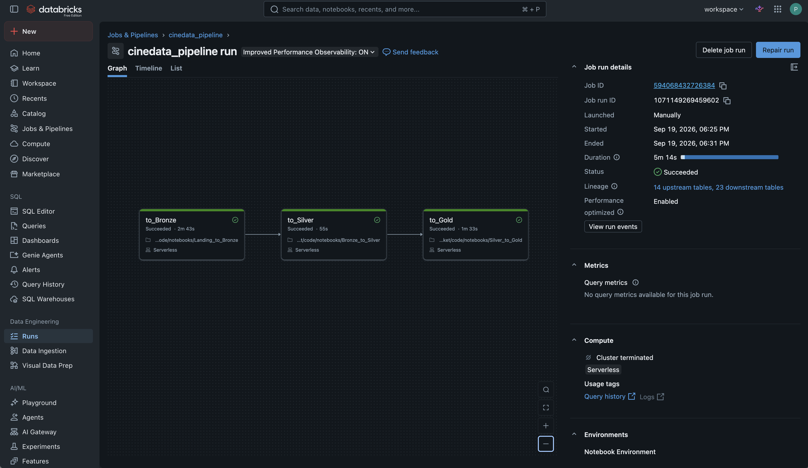
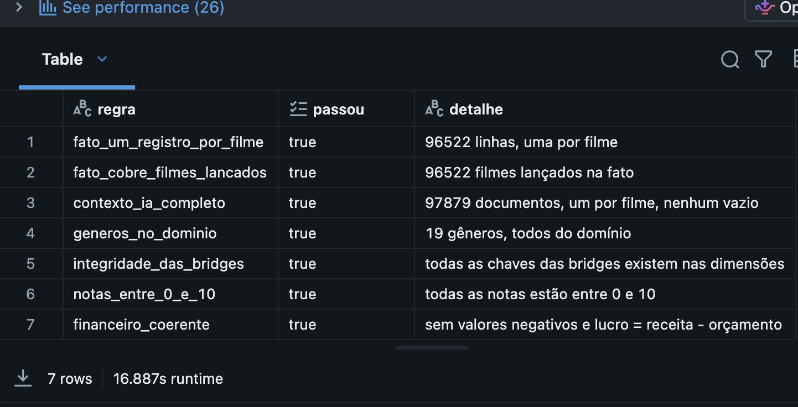

# CineData Analytics — Pipeline de Dados (Databricks | PySpark | SQL)

[](https://github.com/LFPerylo/atividade-dados-rocket/actions/workflows/ci.yml)

Pipeline de dados end-to-end para o catálogo de filmes da CineData Analytics (base TMDB/IMDb),
seguindo a **Arquitetura Medalhão** (Bronze, Silver, Gold) no Databricks. Projeto da disciplina
de Engenharia de Dados, RocketLab 2026.2. Enunciado em [docs/stream.pdf](docs/stream.pdf).

## Visão geral

```
CSVs (Volume) + API BCB ─► Bronze ─► Silver ─► Gold ─► validate_Gold
                            (raw)    (limpo)   (Star Schema + contexto IA)   (quality gate)
```

| Camada | Notebook | O que faz |
|---|---|---|
| Bronze | `Landing_to_Bronze` | Ingere os 5 CSVs e a cotação do dólar (API do Banco Central) em Delta, modo `append`, com `ingestion_datetime`, sem alterar o conteúdo |
| Silver | `Bronze_to_Silver` | 7 tabelas em português, tipadas, limpas e deduplicadas |
| Gold | `Silver_to_Gold` | Star Schema (1 fato, 5 dimensões, 3 bridges), tabela `gold_genai_movies_context` para o RAG e as 6 perguntas de negócio |
| Qualidade | `Validate_Gold` | Roda 7 regras sobre a Gold e reprova o Job se alguma falhar |

## Arquitetura do código

A lógica de negócio vive em **funções Python puras** (recebem e devolvem DataFrames, sem I/O e sem
`dbutils`), organizadas por camada. Os notebooks são **finos**: leem tabelas, chamam essas funções
e gravam em Delta. Isso permite testar toda a regra de negócio localmente, sem cluster.

```
code/
├── src/
│   ├── bronze/    # ingestion_datetime, conversão da cotação
│   ├── silver/    # filmes, financeiro, engajamento, avaliações, gêneros, pessoas/empresas, cotação
│   ├── gold/      # star_schema, genai_context, validacao (quality gate)
│   └── common/    # cliente da API PTAX, deduplicação, tipagem segura, SparkSession de teste
├── notebooks/     # Landing_to_Bronze, Bronze_to_Silver, Silver_to_Gold, Validate_Gold
└── tests/unit/    # pytest, espelha src/
job.yaml           # Workflow exportado do Databricks
docs/evidencias/   # prints da execução
```

Engenharia aplicada: TDD (teste antes do código), CI no GitHub Actions (lint com `ruff` + testes a
cada push), `pre-commit`, commits pequenos com mensagem descritiva e um `CLAUDE.md` com as
convenções do projeto.

## Orquestração

O Job `cinedata_pipeline` ([job.yaml](job.yaml)) tem 4 tasks com dependência explícita e
agendamento diário às 06:00 (`America/Recife`):

`to_Bronze` → `to_Silver` → `to_Gold` → `validate_Gold`



O quality gate valida invariantes (e não contagens fixas): fato com um registro por filme lançado,
contexto de IA completo, gêneros dentro do domínio, integridade das chaves das bridges, notas entre
0 e 10 e financeiro coerente.



## Desafio de Analytics

Respostas às 6 perguntas de negócio (seção 4 do enunciado), geradas pelo `Silver_to_Gold`. As
consultas em si estão no notebook; aqui é um **snapshot de uma execução** — a receita em R$ e a
"data limite" das perguntas 5 e 6 mudam a cada execução (cotação do dia e novos lançamentos).

> Executado em **20/09/2026**, cotação do dólar (API do Banco Central): **R$ 5,1569**.
> Data limite (último lançamento já ocorrido): **19/02/2026**.

**1. Receita total (R$) de todos os filmes:** R$ 837.771.586.093,11

**2. Top 5 filmes por popularidade:**

| # | Título | Popularidade |
|---|---|---|
| 1 | blue beetle | 2994.357 |
| 2 | Gran Turismo | 2680.593 |
| 3 | The Nun II | 1692.778 |
| 4 | Meg 2: The Trench | 1567.273 |
| 5 | Retribution | 1547.22 |

**3. Filmes por gênero (top 5 de 19):** Drama 32.306 · Documentary 19.073 · Comedy 18.630 ·
Thriller 10.276 · Horror 9.728

**4. Top 10 filmes por receita (título, US$, R$, posição no ranking):**

| # | Título | Receita (US$) | Receita (R$) |
|---|---|---|---|
| 1 | Avengers: Endgame | 2.800.000.000,00 | 14.439.320.000,00 |
| 2 | Avatar: The Way of Water | 2.320.250.281,00 | 11.965.298.674,09 |
| 3 | AVENGERS: INFINITY WAR | 2.052.415.039,00 | 10.584.099.114,62 |
| 4 | spider-man: no way home | 1.921.847.111,00 | 9.910.773.366,72 |
| 5 | The Lion King | 1.663.075.401,00 | 8.576.313.535,42 |
| 6 | Top Gun: Maverick | 1.488.732.821,00 | 7.677.246.284,61 |
| 7 | Barbie | 1.428.545.028,00 | 7.366.863.854,89 |
| 8 | The Super Mario Bros. Movie | 1.355.725.263,00 | 6.991.339.608,76 |
| 9 | Black Panther | 1.349.926.083,00 | 6.961.433.817,42 |
| 10 | Star Wars: The Last Jedi | 1.332.698.830,00 | 6.872.594.596,43 |

**5. Ator com mais participações nos filmes lançados nos últimos 2 anos:** Kevin Hart, com
**66** participações (2º: Josh Hartnett, 61).

**6. Produtora com maior lucro nos últimos 5 anos:** Universal Pictures, **US$ 5.772.329.679,00**
de lucro (2ª: Marvel Studios, US$ 4.953.462.823,00).

## Como rodar os testes localmente

Pré-requisitos: **Python 3.12** e **JDK 17** (o PySpark 3.5 não roda com Python 3.14 nem com JDK muito
novo; em macOS: `brew install python@3.12 openjdk@17`).

```bash
python3.12 -m venv .venv
source .venv/bin/activate

# aponta o venv para o JDK 17 (uma vez só, após criar o venv)
cat >> .venv/bin/activate <<'EOT'
export JAVA_HOME="$(brew --prefix openjdk@17)/libexec/openjdk.jdk/Contents/Home"
export PATH="$JAVA_HOME/bin:$PATH"
EOT
source .venv/bin/activate

pip install -r requirements.txt
pytest code/tests/unit -v
ruff check code/src code/tests
```

A sessão Spark de teste liga o modo **ANSI** (como o Databricks Serverless), para que erros de
conversão apareçam nos testes e não só na nuvem.

## Como executar no Databricks

1. Suba os 5 CSVs para um Volume (`/Volumes/workspace/default/inputs/Inputs`).
2. Conecte este repositório em **Workspace → Git folder**.
3. Crie o Job com as 4 tasks (ou use o [job.yaml](job.yaml) como referência) e execute.

Ao atualizar o código (`Pull` no Git folder), reinicie o Python do notebook
(`dbutils.library.restartPython()`), senão o módulo antigo continua em memória.

## Qualidade dos dados de origem e decisões tomadas

Os 5 CSVs são intencionalmente sujos. Estes são os problemas medidos nos dados reais e a decisão
tomada em cada um (regras completas no enunciado):

| Problema encontrado | Decisão |
|---|---|
| Aspas quebradas e texto de outras bases dentro das colunas numéricas (`movies_metrics` tem linhas com até 24 campos) | Bronze lê uma linha física por registro, sem `multiLine` (com ele o Spark perdia ~4 mil linhas). A Silver converte só o que é número válido; o resto vira `NULL`. |
| `popularity` com vírgula decimal (`89,985`) e texto vazado | Só troca vírgula por ponto; nunca apaga caracteres (apagar juntava dígitos de texto e criava números falsos). |
| Linhas com column shift onde `popularity` parece um número válido, mas é outro dado arrastado pelo deslocamento (ex.: "Battipaglia 1969" tem `popularity=1969`, o número do próprio título, não uma métrica) | Se as colunas de nota/contagem da mesma linha trazem texto (não célula vazia), a popularidade da linha também vira `NULL`, mesmo parecendo válida — um número sintaticamente correto não é dado confiável nessas linhas. |
| `budget` em `97000000`, `$ 97000000`, `USD 150000000`, `34.0M`, `250.5K`; `revenue` com `Unknown`/`Não Informado`/negativos | Parse estrito de prefixo de moeda e sufixo K/M/B; ausência, zero, negativo e valor fora do intervalo do tipo viram `NULL`. |
| ~86% dos orçamentos e ~88% das receitas são `0` na origem | Tratados como ausentes, conforme o enunciado; por isso há muitos `NULL` na fato. |
| Mesmo filme repetido até 34 vezes (info, financials e metrics), às vezes com valores conflitantes | Mantém o registro mais recente; no empate, o mais completo; por fim um hash do conteúdo (resultado determinístico). Garante um registro por filme na fato. |
| Datas em `yyyy-MM-dd`, `MM-dd-yyyy` e `dd/MM/yyyy`; filme "Lançado" com data em 2029 | Cada formato só é tentado quando o texto casa com o padrão. As perguntas de 2 e 5 anos usam como limite o último lançamento já ocorrido. |
| Coluna de gêneros com `\|` como separador, sinopses e caminhos de imagem (~4 mil "gêneros") | `\|` vira separador e só os 19 gêneros do catálogo são aceitos. |
| Nomes de pessoas/empresas com números, caminhos de imagem, frases longas e resíduos de aspas/barras | Limpa as pontas e descarta o que não é nome; padroniza a caixa preservando nomes mistos (O'Reilly, DiCaprio). |

### Limitações conhecidas

- **Ordem do elenco:** o texto para IA lista os atores em ordem alfabética (determinística), porque a
  tabela-ponte pedida no enunciado não guarda a posição no elenco.
- **A validação roda depois da escrita:** ela avisa (reprova o Job), mas não desfaz a Gold já gravada.
- **Bronze acumula:** o modo `append` (exigido) faz a Bronze crescer a cada execução; a Silver absorve
  as repetições pela deduplicação.
